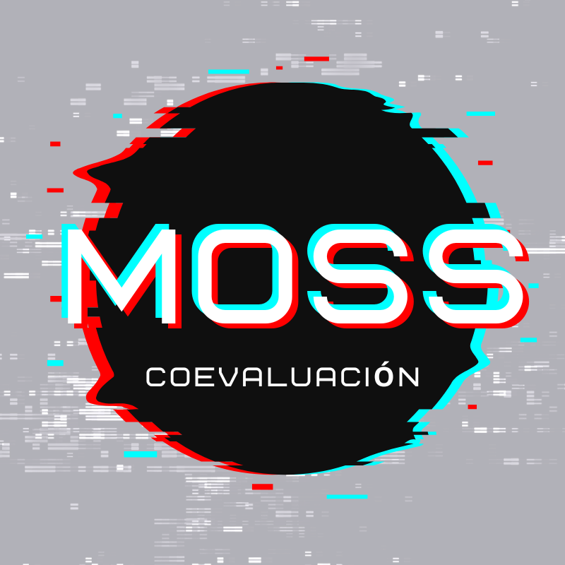

# 🚀 **MOSS Coevaluación: Potencia el Aprendizaje Colaborativo con Evaluaciones Interactivas**

<p align="center">
  
</p>

## **Descripción**
📚 **MOSS Coevaluación** es una innovadora herramienta educativa diseñada para arquitecturas locales, que permite la coevaluación entre estudiantes. Facilita la interacción, mejora la experiencia de aprendizaje, y optimiza las tareas de enseñanza para profesores. Los estudiantes asignan puntajes entre sí, generando un promedio combinado con la evaluación del docente, obteniendo así una calificación final justa y un ranking de desempeño.


## **Requisitos Previos**

🔧 **Tecnologías necesarias**

- **Python 3.9 o superior**  
- **Flask** (framework de Python para aplicaciones web)  
- **pip** para manejar las dependencias  

---

## **Correr el MOSS Coevaluación Backend**

### **Clonar el repositorio**
```bash
git clone https://github.com/Anconeyra/Backend-M.Evaluacion
```

### **Ir a la dirección del proyecto**
```bash
cd Backend-M.Evaluacion
```

### **Crear un entorno virtual y activarlo**
```bash
python -m venv venv  
source venv/bin/activate  # Para Linux/Mac  
venv\Scripts\activate     # Para Windows
```

### **Instalar dependencias**
```bash
pip install -r requirements.txt
```

### **Iniciar el servidor**
```bash
flask run
```

---

### **Notas Adicionales**
- Asegúrate de tener configuradas las variables de entorno necesarias para la conexión a la base de datos u otras configuraciones específicas.
- Flask utiliza por defecto el puerto 5000. Puedes cambiarlo con:
  ```bash
  flask run --port=8080
  
